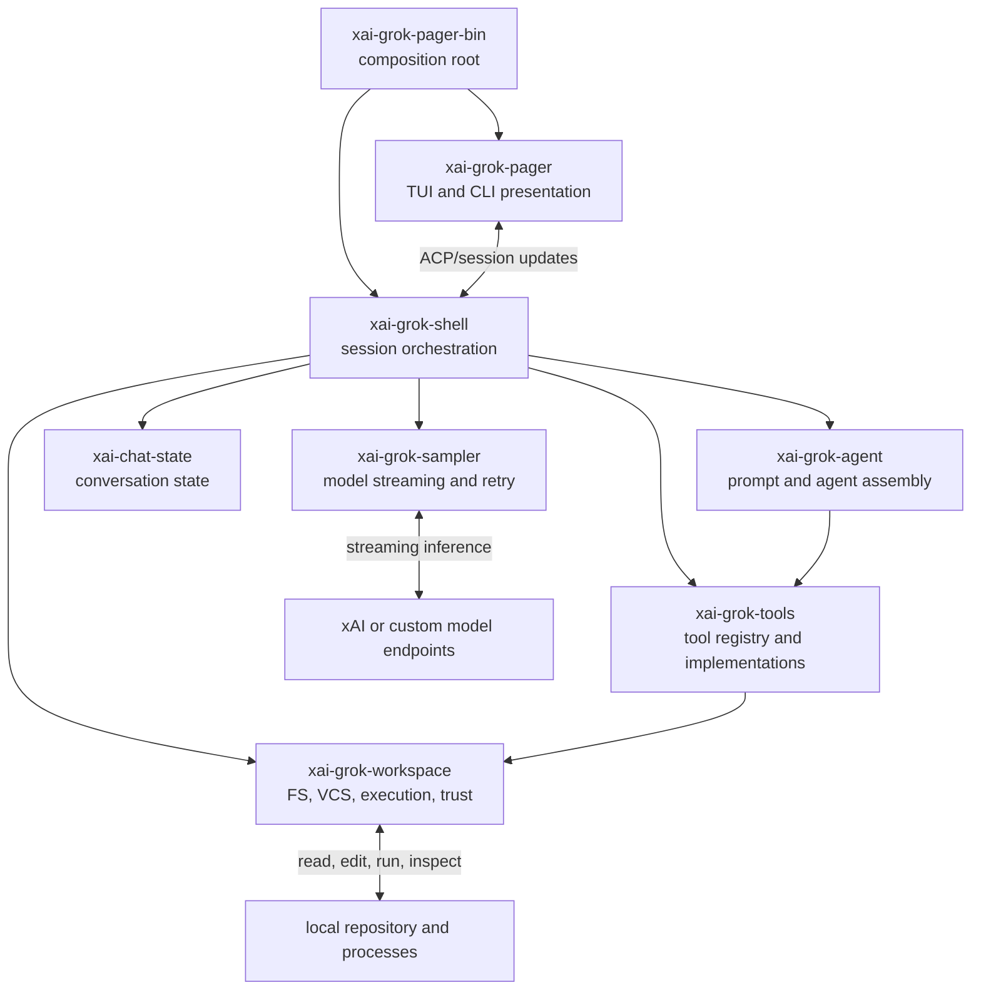

# Grok Build architecture

This document is a contributor map of the open-source tree. It describes the
runtime that is present in this repository, not unpublished services in the
SpaceXAI monorepo.

## System at a glance

Grok Build is one Rust executable with several operating modes. The executable
can launch the full-screen terminal UI, run a one-shot headless prompt, expose
an Agent Client Protocol (ACP) process, or manage a long-lived leader/workspace
process. All of those modes share the same session, agent, model, tool, and
workspace libraries.



The arrows show the main runtime collaboration, not every Cargo dependency.
`xai-grok-shell` is intentionally a broad application layer, while smaller
crates isolate data types or reusable mechanisms.

## Entry points and operating modes

The composition root is
`crates/codegen/xai-grok-pager-bin/src/main.rs`. It installs process-wide
services such as the allocator hooks, crash handling, telemetry, sandbox
requirements, and Tokio runtime before dispatching the selected mode.

| Mode | Entry path | Responsibility |
| --- | --- | --- |
| Interactive | no subcommand or prompt flag | Starts `xai-grok-pager`, which owns terminal input, rendering, panes, and session UI. |
| Headless | `grok -p`, prompt JSON, or prompt file | Uses `xai-grok-shell::agent::app::run_headless` and emits script-friendly output without the TUI. |
| ACP agent | `grok agent stdio` | Uses `run_stdio_agent` so editors and other clients can drive sessions over ACP. |
| Leader | leader-enabled launch | Uses `run_leader` for a long-lived session host that clients can discover and control. |
| Management commands | `inspect`, `mcp`, `plugin`, `worktree`, `workspace`, and others | Dispatches to the owning pager or shell module, then exits without starting a normal interactive session. |

`crates/codegen/xai-grok-pager-bin/Cargo.toml` explains why the executable is a
separate composition crate: it can link both the full pager and the optional
minimal renderer without introducing a Cargo dependency cycle.

## A turn through the system

### Interactive turn

1. `xai-grok-pager` collects terminal input in `PromptWidget` and represents UI
   changes as actions and asynchronous effects.
2. The pager sends the prompt to a session hosted by `xai-grok-shell` and
   renders streamed ACP/session updates.
3. The shell's `SessionActor` normalizes input, updates persistent conversation
   state, assembles the active agent, and enters the agentic turn loop.
4. `xai-grok-agent` combines the base prompt, project rules such as
   `AGENTS.md`, selected skills, agent definitions, and the active tool set.
5. `xai-grok-sampler` sends the model request and streams text, reasoning, and
   tool calls. The shell owns higher-level recovery such as compaction or auth
   refresh followed by resubmission.
6. Tool calls are resolved by `xai-grok-tools`. Host-local operations cross the
   trust, permission, sandbox, and execution boundaries owned by
   `xai-grok-workspace` and related tool-runtime crates.
7. Tool results are appended to conversation state and the loop samples again
   until the model returns a terminal response, the turn is cancelled, or an
   unrecoverable error is reported.
8. The shell persists updates and usage data while the pager turns session
   updates into scrollback, tool panes, status, and notifications.

### Headless and ACP turns

Headless and ACP modes bypass the TUI, not the agent runtime. They still use the
shell's session actor, agent assembly, sampler, tools, workspace boundary, and
persistence. This is an important design constraint: behavior that should be
consistent across interactive, CI, and editor use belongs below the pager.

## Provider, Plan Mode, and external-agent extensions

The multi-agent baseline is deliberately composed from native primitives
instead of a fixed planner/executor/reviewer workflow engine.

### Provider and model resolution

`xai-grok-shell` resolves named providers, physical models, and logical
`route:*` aliases into a model catalog before a turn starts. A provider owns
its endpoint, protocol, authentication policy, headers, retry/timeout settings,
and prompt-cache policy. A provider-bound model never borrows the ambient xAI
credential.

A route selects the first configured candidate that exists, is enabled, and
has any required provider credential. That choice is fixed for the request:
transport retries stay inside `xai-grok-sampler` and never fail over to another
provider after a request has begun. The sampler receives only the resolved
model, transport, credential, and cache configuration.

### Planner and executor

`/plan` remains a mode transition inside the current session. The
`[modes.plan]` profile can temporarily apply a different model or route plus
plan-only instructions and skills. The session actor snapshots the original
model and restores it on exit only if the user has not manually switched
models in the meantime. Scoped-model transitions use a write-ahead
`plan_mode.json` record and acknowledge state/model/commit writes only after
the session files are synced; sampling does not cross a failed transition
barrier. Startup reconciles any pending record before accepting prompts.

The planner remains in the same conversation. Consequently, the selected
provider receives the transcript and read/search results carried by that
request; a mode-specific model is not a data-isolation boundary.

Active Plan Mode is enforced at tool dispatch, before normal permission
handling. It permits read-oriented tools and writes to the session's
`plan.md`, while rejecting shell commands, subagents, arbitrary extension
tools, generators, and other side-effecting operations. After plan approval,
the same main session is the executor, preserving transcript, permissions,
compaction, cancellation, and usage accounting.

The auto-approved plan path is a separate filesystem boundary. Unix access
walks parent directory descriptors without following links, rejects final
symlinks and hard links, and writes via a synced same-directory temporary file
plus atomic rename. The non-Unix fallback rejects links seen during validation
but, because it lacks a handle-relative parent walk, does not claim the same
protection against a concurrent reparse-point swap.

### External-agent notification

An asynchronous reviewer is one use of the generic extension boundary:

1. A command-only `PostToolUse` hook recognizes a successful direct
   `git commit`, atomically claims the repository/commit pair, and launches a
   detached headless reviewer.
2. The reviewer uses a normal named agent definition, so its model or route,
   prompt, and tool set remain plugin configuration maintained outside this
   runtime repository.
3. On completion it calls `grok sessions notify` with a stable notification
   ID.
4. The leader accepts the result only for an already-live session, queues it
   through that session's actor, and optionally wakes an idle turn.

External findings are inserted as explicitly untrusted user-level content,
not as system instructions. Notification deduplication is bounded and
leader-process-local; an external adapter owns any stronger job idempotency.
The release archive does not bundle a reviewer hook or agent.

The Messages transport can emit either the legacy five-minute cache breakpoint,
an explicit one-hour breakpoint, or no breakpoint. Cache reads and five-minute
versus one-hour writes are retained through session and headless usage
accounting.

## Crate map

The workspace contains 79 members. The following groups are more useful for
navigation than a flat crate list.

### Product composition and presentation

| Crate/path | Owns |
| --- | --- |
| `xai-grok-pager-bin` | Executable composition, global startup, mode dispatch. |
| `xai-grok-pager` | Full TUI state, actions/effects, views, scrollback, commands, input. |
| `xai-grok-pager-render` | Presentation primitives shared by pager render modes. |
| `xai-grok-pager-minimal` | Scrollback-native minimal rendering mode. |
| `xai-grok-markdown*`, `xai-grok-mermaid` | Streaming Markdown, syntax, and diagram rendering. |
| `xai-ratatui-*` | Terminal UI support components. |

The pager itself follows an action/effect design: terminal or session input
becomes an action, dispatch updates state and schedules effects, and views
render the resulting state. Its crate README contains the internal directory
map.

### Agent and session runtime

| Crate/path | Owns |
| --- | --- |
| `xai-grok-shell` | Application configuration, auth integration, sessions, turn loop, persistence, compaction coordination, leader/headless/stdio hosts. |
| `xai-grok-agent` | Agent definitions, discovery, prompt templates, `AGENTS.md`, skills, and tool selection. |
| `xai-chat-state` | Actor-based conversation state and usage tracking. |
| `xai-agent-lifecycle` | Lifecycle event types and delivery. |
| `xai-grok-compaction` | Transport-independent history compaction mechanisms. |
| `xai-grok-memory` | Cross-session memory storage, indexing, and retrieval. |
| `xai-grok-subagent-resolution` | Resolves subagent persona, role, and spawn-time overrides. |

The main session implementation is under
`xai-grok-shell/src/session/acp_session*`. This is the first place to inspect
for turn ordering, cancellation, retries, tool-loop behavior, or streamed
session events.

### Model and transport boundary

| Crate/path | Owns |
| --- | --- |
| `xai-grok-sampler` | Inference requests, streaming, retry mechanics, and sampling metrics. |
| `xai-grok-sampling-types` | Sampling API data types without shell coupling. |
| `xai-grok-models` | Embedded default model IDs. |
| `xai-grok-auth`, `xai-grok-http`, `xai-grok-env` | Credential seams, shared HTTP clients, and endpoint presets. |
| `xai-acp-lib` | Shared ACP transport and message helpers. |
| `xai-grok-mcp` | MCP integration, credentials, OAuth, and server connections. |

### Tools and host boundary

| Crate/path | Owns |
| --- | --- |
| `xai-grok-tools` | Built-in tool schemas, registry, execution bridges, and implementations. |
| `xai-grok-tools-api` | Protobuf API definitions for Grok tools. |
| `xai-grok-workspace` | Local filesystem, repositories, commands, trust, checkpoints, uploads, and workspace service. |
| `xai-grok-workspace-client`, `xai-grok-workspace-types` | Typed client and wire types for remote/proxied workspace operations. |
| `xai-grok-sandbox` | OS-level process and filesystem isolation. |
| `xai-tool-types`, `xai-tool-runtime`, `xai-tool-protocol` | Platform-level tool descriptions, dispatch, and wire protocol. |
| `xai-computer-hub-*` | Local/remote tool routing, connection management, and MCP adaptation. |

Supporting crates such as `xai-codebase-graph`, `xai-fast-worktree`,
`xai-fsnotify`, `xai-hunk-tracker`, `xai-file-utils`, and `ptyctl` implement
focused host capabilities used through those boundaries.

### Configuration, extensions, and operations

| Crate/path | Owns |
| --- | --- |
| `xai-grok-config`, `xai-grok-config-types` | Effective configuration and leaf config value types. |
| `xai-grok-hooks`, `xai-hooks-plugins-types` | Hook discovery/execution and extension wire types. |
| `xai-grok-plugin-marketplace` | Plugin marketplace sources and installation metadata. |
| `xai-grok-telemetry`, `xai-tracing*`, `xai-mixpanel` | Diagnostics, traces, product events, and reporting. |
| `xai-grok-secrets` | Sanitization of outbound diagnostic data. |
| `xai-grok-update`, `xai-grok-version` | Release update and version behavior. |

## State, configuration, and extension discovery

- Runtime configuration is resolved by `xai-grok-config`; the shell converts
  the effective config into session and sampling configuration.
- Project instructions are assembled by `xai-grok-agent`. Rules are discovered
  from the repository root toward the working directory, so deeper rules can
  refine root rules.
- Project-scoped agents, skills, plugins, hooks, MCP settings, and LSP settings
  live under `.grok/` when present. The full discovery rules are documented in
  the pager user guide.
- Session persistence, search, replay, and usage accounting live under
  `xai-grok-shell/src/session/`; cross-session semantic memory is a separate
  concern in `xai-grok-memory`.
- Local host effects must continue to pass through trust, permissions, and the
  configured sandbox. Presentation code should not perform those effects
  directly.

## Repository layout and generated boundaries

```text
crates/build/       build-time helpers such as protobuf discovery
crates/codegen/     product crates synced from the monorepo closure
crates/common/      shared leaf/runtime crates
prod/mc/            lightweight production API types included by the closure
third_party/        vendored source and license notices
bin/                hermetic tool launchers, including protoc via DotSlash
```

The root `Cargo.toml` is generated and should be treated as read-only. Add or
change dependencies in the owning crate manifest. `SOURCE_REV` identifies the
monorepo revision represented by the public snapshot.

## Where to make a change

| Change | Start in |
| --- | --- |
| Terminal layout, input, scrollback, modal, slash command | `xai-grok-pager` |
| Process startup or top-level CLI dispatch | `xai-grok-pager-bin` |
| Turn loop, cancellation, session persistence, headless/ACP parity | `xai-grok-shell` |
| Prompt assembly, project rules, agent definitions, skill injection | `xai-grok-agent` |
| Model request/stream/retry transport | `xai-grok-sampler` |
| Built-in tool behavior or schema | `xai-grok-tools` |
| Filesystem, Git, process, trust, checkpoint, remote workspace | `xai-grok-workspace` and its client/types crates |
| Configuration merge or policy precedence | `xai-grok-config` |
| MCP, hook, plugin, or marketplace behavior | the corresponding extension crate plus its shell/pager integration |

When a change crosses one of these rows, document the reason and validate both
the owning crate and its direct consumer. The repository README contains the
recommended targeted Cargo commands.

## Related documentation

- `README.md` — product overview, source build, repository layout, development.
- `AGENTS.md` — repository-wide editing and validation rules.
- `docs/rfcs/0001-multi-provider-multi-agent-runtime.md` — implemented
  provider registry, model routing, scoped Plan Mode, external-agent
  notification, Anthropic cache policy, extension strategy, and standalone
  distribution.
- `crates/codegen/xai-grok-pager/README.md` — pager-internal architecture.
- `crates/codegen/xai-grok-agent/README.md` — agent definition and prompt
  assembly architecture.
- `crates/codegen/xai-grok-shell/README.md` — detailed user and integration
  reference for the shared runtime.
- `crates/codegen/xai-grok-pager/docs/user-guide/` — user-visible behavior and
  configuration.
