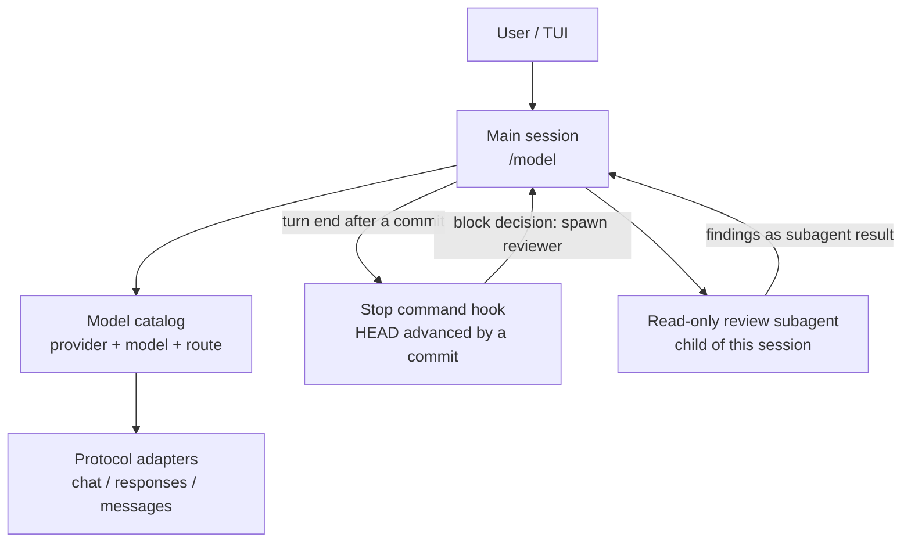

# RFC 0001：Multi-provider、异步 Reviewer 与可分发运行时

- 状态：Implemented（baseline）
- 目标：用少量原生运行时原语支持多 provider、model route 和 reviewer
- 影响范围：config、model catalog、session、sampler、hooks、distribution

## 1. 结论

本项目不在第一版引入一套固定的 `plan -> execute -> review` 工作流引擎。
实现采用更小、也更接近 Claude Code 的组合：

1. **Provider / model / route 是原生能力。** 每个 provider 有独立 endpoint、
   protocol、认证、headers、重试、超时和 cache policy；model 引用 provider；
   logical route 在请求开始前选择一个物理模型。
2. **Plan Mode 完全跟随上游。** fork 不增加 mode profile、scoped model、
   持久化 barrier、文件防护或额外工具限制。
3. **Executor 就是 main session。** 计划获批后仍由当前会话执行；用户可随时
   用 `/model` 切换 main 的模型，不需要复制上下文到一个 executor child。
4. **Reviewer 是 main session 的只读 subagent。** `Stop` hook 在 turn 结束时
   发现 `HEAD` 被 commit 推进，就返回 block decision 要求 main spawn 一个
   只读 review subagent；结果沿 subagent 原生回传，由 main 判断修复、忽略、
   继续或请求用户输入。
5. **Skill / agent / hook / plugin 负责编排内容，核心负责不变量。**
   Prompt、工具集、模型选择和 hook 配置可以随 profile/plugin 分发；provider
   凭据边界、live-session 注入、幂等和持久化必须留在核心。
6. **Anthropic 1h cache 和 portable distribution 是原生能力。**
7. **Reviewer 策略不随 terminal/runtime 分发。** 核心只提供 command hook、
   `Stop` block decision 和 subagent 原语；触发条件、prompt 和 adapter 由独立
   的 `grok-build-configs` plugin 维护。共享插件不注册泛化 reviewer agent，
   subagent 沿用当前 session 的 model/route/provider 解析。

这使“Hook 只能执行 command”不再是限制：command 是薄适配器，它只需判断该不该
review，并把请求交回 main；真正的执行由 session 自己的 subagent 承担。

## 2. 目标与非目标

### 2.1 目标

- 同一进程中配置并使用多个 provider 和多个 model。
- main、subagent、reviewer 可分别选择物理模型或 logical route。
- provider-bound model 不会误用 xAI 登录 token。
- Plan Mode 的状态机、审批流和工具行为不引入 fork 分歧。
- reviewer 不阻塞 commit tool，也不并发 resume 同一个 session。
- reviewer 结果能进入当前 live session，并支持进程内幂等重试。
- Messages adapter 支持 5m、1h 和 off cache policy（放置逻辑跟随上游）。
- 构建物可以复制到另一台同平台机器运行，不携带用户凭证和 session。

### 2.2 非目标

- 不实现任意 DAG、repair loop 或持久化 workflow engine。
- 不在已经开始的请求中自动切换 provider。
- 不把外部 reviewer 输出提升为 system authority。
- 不加载 Rust dylib plugin ABI。
- 不在不同 provider 之间共享 prompt cache。
- 不跨平台复用同一个二进制；每个 target 仍需独立产物。

## 3. 整体架构


```mermaid
flowchart TD
    User["User / TUI"]
    Main["Main session\n/model"]
    Catalog["Model catalog\nprovider + model + route"]
    Sampler["Protocol adapters\nchat / responses / messages"]
    Hook["Stop command hook\nHEAD advanced by a commit"]
    Reviewer["Read-only review subagent\nchild of this session"]

    User --> Main
    Main --> Catalog
    Catalog --> Sampler
    Main -->|"turn end after a commit"| Hook
    Hook -->|"block decision: spawn reviewer"| Main
    Main --> Reviewer
    Reviewer -->|"findings as subagent result"| Main
```

关键边界：

- `xai-grok-shell` 拥有 session actor、model resolution 和通知注入。
- `xai-grok-sampler` 只接收已解析的 transport/model/cache 配置。
- `xai-grok-agent` 与 skills 提供 prompt 和工具组合。
- `xai-grok-hooks` 只执行 hook command；脚本负责进程级编排。
- `xai-grok-pager` 负责 `/plan`、`/model`、session CLI 和呈现。
- `xai-grok-workspace` 继续拥有命令、权限和 sandbox。

## 4. Multi-provider 与 Multi-model

### 4.1 数据模型

四个概念保持分离：

| 概念 | 职责 |
| --- | --- |
| Protocol | `chat_completions`、`responses`、`messages` 的 wire shape |
| Provider | endpoint、认证、headers、retry、timeout、cache policy |
| Model | 上游 model id、context window、sampling 和能力元数据 |
| Route | 某个逻辑用途对应的有序物理 model 候选 |

`ApiBackend` 继续表示 protocol，不改名为 provider。

### 4.2 配置

> **2026-09-17 修订。** 上游已引入 `[model_providers.<id>]` 表与
> `model_provider` 绑定（含 base_url/credentials/headers 的继承，model
> 字段优先）。本 fork 的 provider 实现已收敛到该机制之上：transport 与
> credential 继承完全走上游路径；fork 独有语义（auth scheme、prompt-cache
> TTL、retry/timeout、凭据隔离）以旁路 policy（`auth_scheme` 等键）在
> `apply()` 之后作为增量层施加。原 `[provider.<name>]` + `provider =`
> 拼写在解析前归一化为上游形状（legacy 别名，行为不变）；"model 不得
> 覆盖 provider-owned 字段"的禁止规则已让位于上游的"model 优先"语义
> （认证 header 保护不变）。示例按新拼写更新，旧拼写仍被接受。

```toml
[model_providers.anthropic]
base_url = "https://api.anthropic.com/v1"
api_backend = "messages"
auth_scheme = "x_api_key"
env_key = "ANTHROPIC_API_KEY"
extra_headers = { "anthropic-version" = "2023-06-01" }
max_retries = 5
inference_idle_timeout_secs = 300
prompt_cache = { mode = "stable_prefix", ttl = "1h" }

[model_providers.openai]
base_url = "https://api.openai.com/v1"
api_backend = "responses"
auth_scheme = "bearer"
env_key = "OPENAI_API_KEY"

[model_providers.local]
base_url = "http://127.0.0.1:11434/v1"
api_backend = "chat_completions"
auth_scheme = "none"

[model.claude-primary]
model_provider = "anthropic"
model = "claude-sonnet"
context_window = 200000

[model.openai-fallback]
model_provider = "openai"
model = "gpt-codex"
context_window = 400000

[model.local-reviewer]
model_provider = "local"
model = "qwen-coder"
context_window = 65536

[model_route.primary]
candidates = ["claude-primary", "openai-fallback"]

[model_route.reviewer]
candidates = ["local-reviewer", "claude-primary"]
```

Provider `auth_scheme` 取值：

- `bearer`：发送 `Authorization: Bearer ...`；
- `x_api_key`：发送 `x-api-key: ...`；
- `none`：不发送认证 header。

`api_key` 和 `env_key` 是 provider 的 credential source。推荐使用 `env_key`。
认证 header 不能同时放进 `extra_headers`。

### 4.3 兼容和安全规则

- 未绑定 provider 的旧 `[model.*]` 完全保留现有 credential fallback。
- 继承语义跟随上游：provider 字段是默认值，model 同名字段优先。
- 绑定到带 `auth_scheme` 的 provider 后，model 只使用该 provider 的
  credential source，绝不 fallback 到 xAI session token 或 `XAI_API_KEY`。
- `auth_scheme = "none"` 与 credential 同时出现是配置错误。
- 同一 provider 用两种拼写声明、同一 model 同时设置 `provider` 与
  `model_provider`、空 route、nested route 和认证 header 冲突在配置加载时失败。

### 4.4 Route 语义

Route 在 catalog 构建时按顺序选择第一个 preflight-ready candidate：

- model 必须存在且未被 disabled；
- 需要认证的 provider 必须能解析 credential；
- 未通过 preflight 时才尝试下一个 candidate。

选中后 route 形成隐藏的 `route:<name>` catalog alias。它不会出现在 model
picker 中，但可供 default、agent 和 subagent 显式引用。

第一版只做 `preflight_only` fallback。请求一旦开始，retry 仍属于同一个
provider/model；不会因 timeout、429、5xx 或已经产生语义事件而跨 provider。
这样可以避免重复 tool call、重复计费和不同模型间的上下文漂移。

## 5. Plan Mode：跟随上游

本 fork 不再扩展 Plan Mode。`/plan` 的状态机、`plan.md`、审批流程、
工具 gate、持久化和恢复语义均直接跟随 `upstream/main`。配置中不提供
`[modes.plan]`，也不会在进入 Plan Mode 时自动切换 model/route、注入额外
instructions/skills，或在退出时恢复模型。

上游 gate 只约束文件编辑工具：允许写 session 的 `plan.md`，拒绝其他文件
编辑与 `apply_patch`。Bash、MCP、subagent、scheduler、media generator 和
`todo_write` 等非编辑工具继续进入普通 permission 流程；always-approve 可自动
运行这些工具。subagent 使用自己的 Plan Mode tracker，因此 parent 的 Plan Mode
不会把 child 变成只读环境。

需要为规划选择其他 provider 时，用户仍可通过普通 `/model` 或 agent 配置显式
选择；fork 不为 Plan Mode 增加隐式、session-scoped 的模型 ownership。

## 6. Executor：main session

计划获批后不创建新的 executor session。这样做有三个直接收益：

- 无需复制或压缩 planner conversation；
- plan approval、用户反馈和执行过程保留在同一 transcript；
- 现有 permission、sandbox、compaction、usage 和 cancellation 路径全部复用。

Main 的模型继续由现有 `/model` 控制，也可以把 `[models].default` 指向
`route:primary`。未来如果需要隔离执行，仍可使用现有 subagent/worktree，
但它不是这套 baseline 的必选步骤。

## 7. Reviewer：Stop hook + 只读 subagent

### 7.1 为什么 command hook 足够

Hook 不需要直接理解 agent，也不需要自己跑 reviewer。它只需在 turn 结束时判断
“这一轮是否产生了新 commit”，然后把请求交回 main：

```text
SessionStart event
  -> record HEAD as this session's baseline

Stop event (reason == end_turn)
  -> compare HEAD against the baseline
  -> unchanged, or moved by a non-commit operation: advance baseline, do nothing
  -> moved by a commit: advance baseline, emit a block decision asking main to
     spawn a read-only review subagent for that exact SHA
```

Subagent 是当前 session 的子节点，结果在它结束时原生回传，不需要 leader、
socket 或外部进程；headless 会话同样成立。baseline 在发出 block **之前**推进，
所以同一个 commit 不会被反复要求 review，stop-continuation 上限是二次兜底。

### 7.2 Hook 配置

```json
{
  "hooks": {
    "SessionStart": [
      {
        "hooks": [
          {
            "type": "command",
            "command": "bash \"${GROK_PLUGIN_ROOT}/scripts/reviewer-hook.sh\"",
            "timeout": 5
          }
        ]
      }
    ],
    "Stop": [
      {
        "hooks": [
          {
            "type": "command",
            "command": "bash \"${GROK_PLUGIN_ROOT}/scripts/reviewer-hook.sh\"",
            "timeout": 10
          }
        ]
      }
    ]
  }
}
```

共享配置不包含 reviewer agent definition，避免与内置 `/review` 的命名和
persona 解析混淆。

### 7.3 Hook adapter 不变量

外部 `async-commit-reviewer` plugin 的 adapter：

- 用真实 JSON parser（Node 或 jq）解析 hook envelope，不用 regex；
- 只在 `reason == "end_turn"` 的真实 turn 结束上动作；
- 用 reflog 区分 commit 类操作与 branch switch / reset / fast-forward pull；
- per-session、per-repo 的 baseline 用密码学摘要做 key，避免碰撞；
- 任何解析或 IO 错误都 fail-open，退出 0，不阻塞 turn；
- 请求的 subagent 必须是 `capability_mode="read-only"` 且针对显式 SHA。

### 7.4 信任边界

Reviewer 输出以普通 subagent 结果的形式回到 main，属于可评估的证据，不是
system 指令。Reviewer 无权替 main 作最终决定，也不能通过输出提升权限。

## 8. Skill、Agent、Plugin 的扩展策略

### 8.1 Baseline 中什么是原生的

必须原生实现：

- provider/model/route resolution；
- session actor queue/wake 语义；
- subagent 生命周期与结果回传；
- prompt-cache wire contract；
- distribution verification。

这些能力涉及安全、并发、恢复或 transport，不适合由 prompt/script 模拟。

### 8.2 什么放在 Skill / Agent / Hook

- 规划领域方法和额外约束：普通 skill 或 agent definition；
- Reviewer 默认沿用普通 headless 配置；可选的专用 persona、模型、tools、
  skills 才放在用户自己的 agent definition；
- 何时触发 review：hook matcher/adapter；
- 一组可复用配置：profile 或 plugin。

一个 plugin 可以打包：

```text
plugin.json
skills/architecture/SKILL.md
hooks/reviewer-after-commit.json
scripts/reviewer-hook.sh
```

它不需要新的 workflow ABI，也不需要进入 runtime release archive。个人
配置仓库可以独立 version、测试和安装该 plugin。

### 8.3 后续扩展

未来可按需要增加：

- 面向真正外部事件（CI、webhook）的 live-session 注入通道；
- hook event filters（commit、push、PR、test completion）；
- reviewer fan-out 与结果聚合；
- reviewer 对 diff artifact 的内容寻址输入；
- route health/capability preflight；
- provider account/workspace 隔离与 cost policy。

只有当产品确实需要跨重启的多 stage DAG、human gate 和有界 repair loop 时，
才应新增核心 workflow scheduler。届时 plugin 可以提供声明式 definition，
但 scheduler、安全、状态和 UI 仍属于核心。

## 9. Anthropic 1 小时 Prompt Cache

### 9.1 Policy

```rust
struct PromptCachePolicy {
    mode: PromptCacheMode, // off | stable_prefix
    ttl: PromptCacheTtl,   // 5m | 1h
}
```

优先级：

1. model override；
2. provider policy；
3. protocol-compatible default。

Messages 保留历史默认：`stable_prefix + 5m`。其他 adapter 忽略该字段。

### 9.2 Wire 行为

- `off`：不产生显式 breakpoint；
- `stable_prefix + 5m`：最后一个稳定 system block 加
  `{"type":"ephemeral"}`，省略 TTL；
- `stable_prefix + 1h`：加
  `{"type":"ephemeral","ttl":"1h"}`。

标记 system prefix 也覆盖 Anthropic prompt 顺序中更早的 tools，因此不需要
单独的 tool-definition breakpoint。

> **2026-08-10 修订。** breakpoint 的**放置**已由上游实现接管
> （`xai-grok-sampling-types` 的 `apply_cache_breakpoints`：system prefix
> 加当前和上一个 conversation tip），上游明确保留第四个 slot 给 gateway 的
> automatic caching。本 fork 只保留 TTL 与 `off` 两项 policy，并且在上游
> 放置完成之后再做一次改写，不再改 upstream 的放置函数签名。中途出现过的
> tool-definition breakpoint 已删除：它既与本节原始设计冲突，也占用了上游
> 预留的 slot。

Anthropic 官方协议说明 5m 默认、`ttl: "1h"`、最多四个 breakpoint，以及
`cache_creation.ephemeral_5m_input_tokens` /
`ephemeral_1h_input_tokens` usage：
[Prompt caching](https://platform.claude.com/docs/en/build-with-claude/prompt-caching)。

### 9.3 Usage

Normalized usage 沿用上游的字段：

- prompt tokens；
- completion tokens；
- cache-read input tokens；
- cache-creation prompt tokens（aggregate）。

> **2026-08-10 修订。** 原方案把 cache-write 拆成 5m / 1h 两个 bucket 并
> 替换了上游的 aggregate 字段。实测该做法在只返回 aggregate
> `cache_creation_input_tokens` 的 provider 上会把 cache-write 记成 0（上游
> 原本能报出真实值），并且改掉了 headless result 里被上游标注为 frozen 的
> 外部兼容字段名。因此回退到上游的单一 aggregate；1h TTL 仍可配置，只是不再
> 单独统计两个 bucket。需要 per-TTL 明细时，应作为**新增**字段提给上游，
> 而不是替换既有字段。

## 10. 独立构建与跨机器复用

### 10.1 Canonical commands

```bash
scripts/dist.sh build \
  --target aarch64-apple-darwin \
  --version 0.2.101

scripts/dist.sh package \
  --target aarch64-apple-darwin \
  --version 0.2.101

scripts/dist.sh verify dist/0.2.101/grok-build-0.2.101-aarch64-apple-darwin.tar.gz
```

Build 使用：

```bash
cargo build --locked \
  -p xai-grok-pager-bin \
  --profile release-dist \
  --features release-dist \
  --target TARGET
```

### 10.2 Archive contract

```text
grok-build-VERSION-TARGET/
  bin/grok
  LICENSE
  THIRD-PARTY-NOTICES
  SOURCE_REV
  build-manifest.json
  MANIFEST.sha256
  profiles/starter/
```

Manifest 记录 source revision、target、toolchain、features、binary hash、
bundled search-tool hashes 和 profile hash。Archive 还生成外部
`SHA256SUMS`。

Starter profile：

- 不含 credential、`auth.json`、session、managed policy 或 cache；
- provider credential 只引用环境变量名；
- 不包含任何 opinionated reviewer hook、agent 或个人 prompt；
- 可复制到任意可写目录并通过 `GROK_HOME` 选择。

Verification 拒绝：

- path traversal 和 symlink；
- 缺失、额外或 hash 不匹配的文件；
- secret-like inline value；
- 文本 payload 中的机器绝对路径；
- 被篡改的 profile/manifest/checksum。

## 11. 测试与验收

### 11.1 Rust

- provider credential isolation、header merge、配置冲突；
- route 顺序、缺 credential fallback、hidden alias、explicit default；
- upstream Plan Mode 定向测试保持不变；
- Messages 5m/1h/off request JSON；
- cache usage wire parsing、ledger fold 和 response metadata；
- subagent 生命周期：spawn、只读 capability、结果回传；
- CLI argument/file-size/error behavior。

### 11.2 Shell / distribution

- 外部 reviewer plugin 自己测试 success、ignored events、failure report、
  baseline 推进、非 commit 的 HEAD 移动、解析失败 fail-open 和 fast return；
- tar/zip creation、reproducibility、checksums、tamper rejection；
- real `release-dist` build；
- archive extraction with isolated `GROK_HOME`；
- extracted `grok --version`、`--help` 和 completion smoke tests。

### 11.3 最终检查

```bash
cargo fmt --all -- --check
cargo check -p xai-grok-sampling-types
cargo test -p xai-grok-sampling-types
cargo check -p xai-grok-sampler
cargo test -p xai-grok-sampler
cargo check -p xai-grok-shell
cargo test -p xai-grok-shell
cargo check -p xai-grok-pager
cargo test -p xai-grok-pager
scripts/dist/test.sh
git diff --check
```

## 12. 取舍记录

### 固定 workflow engine

暂不采用。它会立即引入 stage schema、artifact protocol、repair budget、
recovery 和 UI 等大量状态，而当前需求用已有 Plan Mode、hook 和 subagent 就能
完整表达。

### 只用 prompt/skill

不采用。Skill 适合规划方法，不适合 credential isolation、actor queue、幂等和
cache wire semantics。

### Hook 内直接 resume parent session

不采用。两个进程同时拥有同一个 session 会破坏 actor serialization、
conversation persistence、usage 和 cancellation。

### Reviewer 作为独立进程 + live-session notify

最初的实现。它需要一个 live leader（`~/.grok/leader.sock`）才能投递，而 leader
模式默认关闭，headless 会话根本没有 leader：报告能生成却永远送不进去。改为
turn 结束后派生的**后台只读 subagent**，用原生结果回传取代 socket 注入；
`grok sessions notify` 原语随之移除。

真正的外部事件源（CI 完成、webhook、定时任务）仍然没有注入通道。等到出现确定
的使用场景时再重新引入，并且必须同时给出 leader 默认策略和端到端测试。

### 运行中跨 provider fallback

不采用。只做 preflight routing，避免重复副作用和语义漂移。
